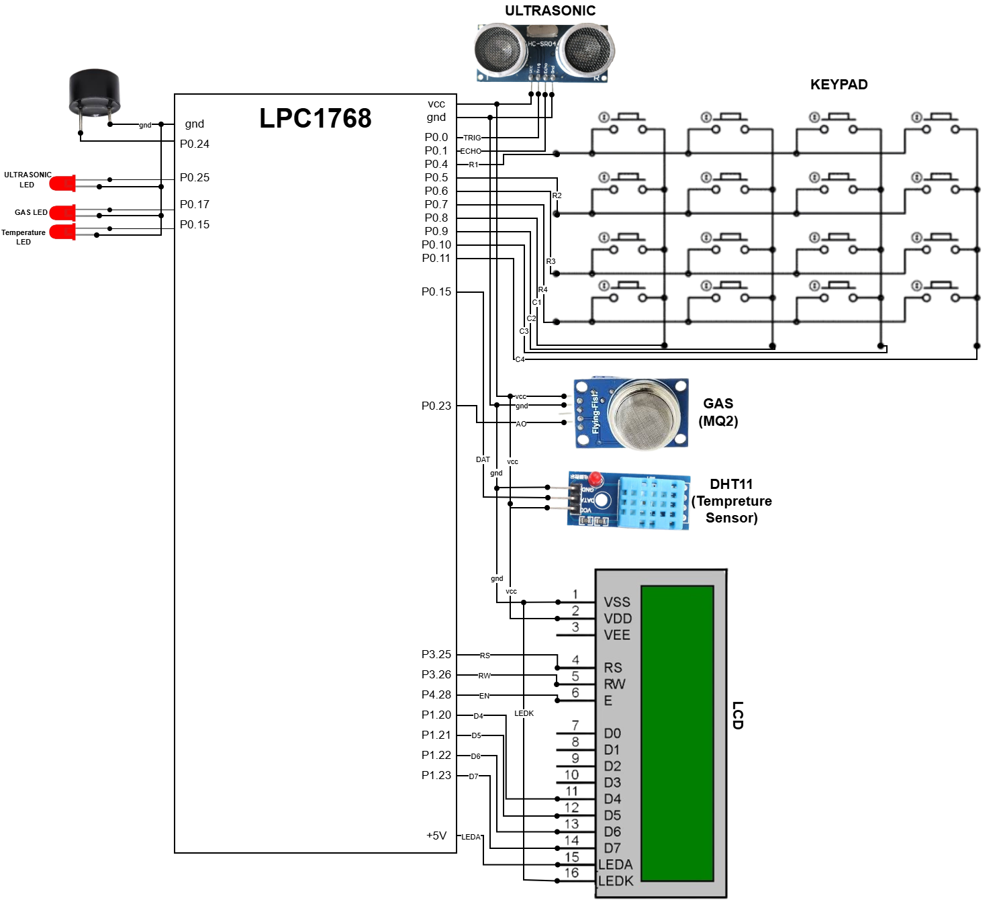

# multi-sensor-threshold-management-rtos
Designed and implemented an RTOS-based embedded firmware on ARM Cortex-M3 (LPC1768) for concurrent multi-sensor monitoring with dynamic threshold configuration and real-time alert generation.

## 📌 Project Overview

This project implements a real-time multi-sensor monitoring system using the LPC1768 (ARM Cortex-M3) microcontroller and Keil RTX RTOS. The system monitors distance, gas concentration, and temperature concurrently. Users can configure safety thresholds dynamically via a 4×4 keypad, and alerts are generated using LEDs and a buzzer when thresholds are exceeded. A 16×2 LCD displays real-time readings and system status.

## 🧠 RTOS Architecture

The system is implemented using Keil RTX RTOS with the following tasks:

- Ultrasonic Task (Distance Monitoring)
- Gas Sensor Task (ADC-Based Monitoring)
- Temperature Task (DHT11 Interface)
- Keypad Task (Threshold Configuration)
- LCD Mutex Protection for shared resource access

Each task runs periodically (~500ms cycle) ensuring deterministic execution and concurrent sensor monitoring.

## 🛠 Hardware Components

- LPC1768 (ARM Cortex-M3)
- Ultrasonic Sensor (HC-SR04)
- Gas Sensor (Analog MQ type)
- DHT11 Temperature Sensor
- 16×2 LCD (4-bit mode)
- 4×4 Matrix Keypad
- LEDs & Buzzer

## 📂 Project Structure

firmware/
├── core/        → Startup & system initialization
├── rtos/        → RTX RTOS configuration
├── application/ → Main scheduler & task creation
├── drivers/     → Sensor and peripheral drivers

## ⚙ Peripheral Interface Mapping

| Peripheral | GPIO Pin |
|------------|----------|
| Ultrasonic TRIG | P0.0 |
| Ultrasonic ECHO | P0.1 |
| Gas Sensor (ADC) | P0.23 |
| DHT11 | P0.16 |
| LCD | P3.25, P3.26, P4.28, P1.20–P1.23 |
| Keypad | P0.4–P0.11 |
| Buzzer | P0.24 |

## 📊 Performance Analysis

### Memory Usage
- Code Memory: 7644 Bytes
- RAM Usage: 2816 Bytes
- Stack Allocation: 50 Bytes per task

### Worst-Case Execution Time
- Ultrasonic Task: ~521ms
- Gas Task: ~502ms
- Temperature Task: ~526ms

## 🔥 Technical Highlights

- ARM Cortex-M3 bare-metal + RTOS development
- Multitasking using Keil RTX
- Mutex-based shared resource protection
- Timer-based ultrasonic pulse width measurement
- 12-bit ADC gas sensing implementation
- Deterministic task scheduling

## System Flow Chart

The following flow chart illustrates the RTOS-based task execution and monitoring logic:

## Interfacing Diagram

